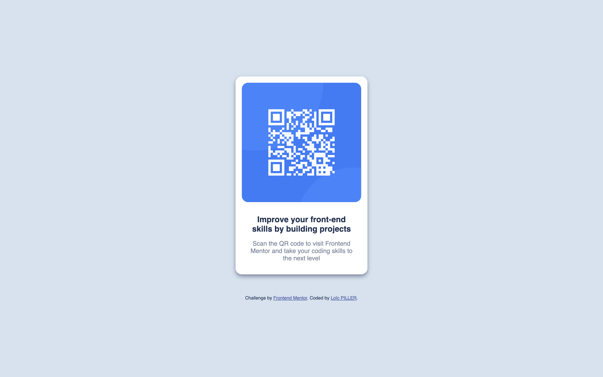

# Frontend Mentor - QR code component solution

This is my solution to the [QR code component challenge on Frontend Mentor](https://www.frontendmentor.io/challenges/qr-code-component-iux_sIO_H).

## Screenshot

## What I learned

This exercise enabled me to put my knowledge into practice. I also discovered the box-sizing property.

## Useful resource

- [flexboxfroggy](https://flexboxfroggy.com) - This helped me for flexbox.
- [MDN](https://developer.mozilla.org/en-US/) - For box-sizing

## Author

- Frontend Mentor - [@LoicPILLER](https://www.frontendmentor.io/profile/LoicPILLER)